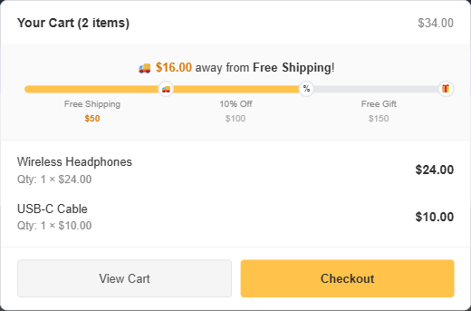
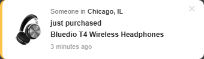
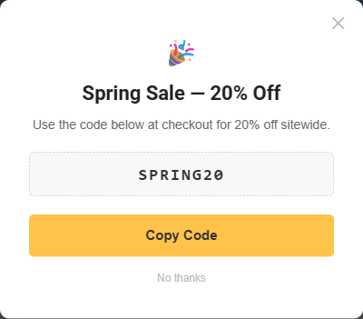
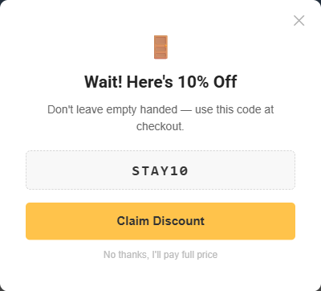

# Release Notes

## 1.4.0 (05-12-2026)
- [CORNERSTONE] Dispatch an event on productOptionsChanged (#2400)
- [CORNERSTONE] Fix: swap content/data keys in onProductOptionsChanged event detail (#2640)
- feat(page-transition): add page transition splash overlay (#302)
- feat(socialproof): port social proof feature from Supermarket — urgency widget, stock pill, cart goal bar, recent sales popup, exit-intent popup, promo popup, newsletter popup coordination. See [Social Proof & Marketing Features](./usage.md#social-proof-marketing-features).
- Feature: Add PDP urgency widget (viewing count + last purchase time). Disabled by default. Enable via Script Manager with `window.dinosaurThemeSettings.urgency`. See [PDP Urgency Widget](./usage.md#pdp-urgency-widget).

  

- Feature: Add cart goal progress bar with multi-milestone support (free shipping, discount, gift, etc.). Disabled by default. Enable via Script Manager with `window.dinosaurThemeSettings.cartGoal`. See [Cart Goal Bar](./usage.md#cart-goal-bar).

  

- Feature: Add recent sales mini-popup sourced from best-sellers / new / featured / manual products. Disabled by default. Enable via `window.dinosaurThemeSettings.recentSales` (safe defaults: delay 8s, max 3 shows per session). See [Recent Sales Popup](./usage.md#recent-sales-popup).

  

- Feature: Add promotional popup with coupon code and clipboard copy. Disabled by default. Configure via `window.dinosaurThemeSettings.promo`. See [Promotional Popup](./usage.md#promotional-popup).

  

- Feature: Add exit-intent popup (desktop mouse-leave / mobile inactivity). Disabled by default. Configure via `window.dinosaurThemeSettings.exit`. See [Exit-Intent Popup](./usage.md#exit-intent-popup).

  

- Change: Existing newsletter popup now coordinates with new popups through a priority queue to prevent overlap. Priority order (highest first): Exit Intent → Promo → Newsletter. Theme settings (`nl_popup_*`) and cookie (`NL_POPUP_HIDE`) preserved.
- Docs: New user guide section [Social Proof & Marketing Features](./usage.md#social-proof-marketing-features) covering configuration and examples.

## 1.3.0 (12-12-2025)
- feat(quick-search): [add keyword suggestion feature](./usage.md#keyword-suggestions) (#298)

<iframe width="560" height="315" src="https://www.youtube.com/embed/mMg9aPb5SJY" title="Quick Search - Keyword Suggestions" frameborder="0" allow="accelerometer; autoplay; clipboard-write; encrypted-media; gyroscope; picture-in-picture; web-share" allowfullscreen></iframe>

## 1.2.3 (11-14-2025)
- fix(infinite-scroll): horizontal filter not working when infinite loading enabled and faceted filters disabled

## 1.2.2 (10-03-2025)
- fix(pdp): js error when product has bulk pricing and shows price with tax

## 1.2.1 (09-12-2025)
- [CORNERSTONE]Add a section to display the payment promotion widget in the drop-down of the cart preview. ([#2523](https://github.com/bigcommerce/cornerstone/pull/2523))
- fix(designer-tool): export all slides correctly and skip empty slides

## 1.2.0 (08-01-2025)
- [CORNERTSONE] PAYPAL-5000 Quick pay buttons are seen on PDP before 'required' option selection (#290)
- [CORNERTSONE] Update to support multiple date fields and remove blank space (#291)
- New Feature: Product Designer Tool (#295)
- Fix definitionList-value inline in preview cart item (#297)
- Update Node.js version in devcontainer and GitHub Actions workflow to 20.x

**Demo Video:**

<iframe width="560" height="315" src="https://www.youtube.com/embed/5E1-lz0vklw?si=Kdu9m-DP66UaODUK" title="YouTube video player" frameborder="0" allow="accelerometer; autoplay; clipboard-write; encrypted-media; gyroscope; picture-in-picture; web-share" referrerpolicy="strict-origin-when-cross-origin" allowfullscreen></iframe>

## 1.1.3 (04-18-2025)
- Add option show sale badge discount amount (#281)
- Add schema config show/hide compare button of product card (#285)
- Fix z-index of sale badges on PDP. Position slick button of product feed widget (#288)

## 1.1.2 (03-28-2025)
- remove hide condition of product_sale_label in theme editor
- fix PLP product grid columns respect theme settings (#282)

## 1.1.1 (03-07-2025)
- fixes #279: you save text not display if product has no default option
- fix js error when card_show_swatches = false and card_show_variantImg = true
- fix saved price calculation

## 1.1.0 (01-24-2025)
- [CORNERSTONE] Add nonce to scripts in checkout and account pages [#2525](https://github.com/bigcommerce/cornerstone/pull/2525)
- [CORNERSTONE] Use fetch when updating variants in cart ([#2521](https://github.com/bigcommerce/cornerstone/pull/2521))

## 1.0.3 (01-10-2025)
- Add theme option to display product description full width (#275)

## 1.0.2 (12-13-2024)
- Show quick payment buttons on PDP
- Display custom badges on recently viewed products (#271)
- Fix top banner carousel (#273)
- Fix duplicated qty box of simple pre-order products of FBT
- Improve performance of open menu on mobile and preview cart popup

## 1.0.1 (11-15-2024)
- Hide custom field name display in product cards (#264)
- Fix undefined 'input-font-color' in add payment methods account page
- Add slider to the center widget region in the header #265 #266 (#267)
- Create file stencil.conf.cjs for Node 20 compatibility
- Fix color of coupon saved popup message

## 1.0.0 (10-31-2024)
- Initial release.
