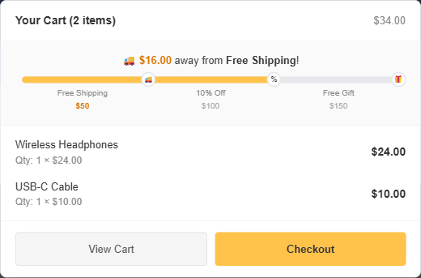
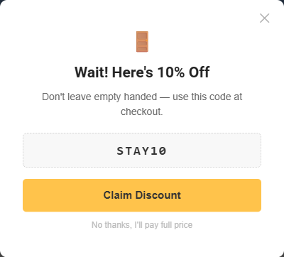

# Release Notes

## 1.5.0 (08-04-2026)
- Feature: Featured promotion callouts — a promotion marked as *featured* in the BigCommerce control panel now shows its callout message on product cards, in list view, on the product detail page and in the Choose Options popup, instead of only revealing itself in the cart. Turn it on and set its two colours in **Page Builder** > **Theme Styles** > **Products** > **Featured Promotions**. See [Featured promotions](./usage.md#featured-promotions).
- Feature: Backorder and stock messaging — products that allow backorders now show how much is ready to ship and how much will be backordered, on the product page, in the cart, in the cart drawer and in account order details, including a per-option breakdown for pick list options. There is no theme setting to switch on; the messages follow each product's inventory and backorder settings. See [Backorder and stock messaging](./usage.md#backorder-and-stock-messaging).
- Change: The shipping countdown is now hidden when a shopper asks for more units than are in stock, so a *ships today* promise is no longer shown next to an item that will be backordered. See [Shipping countdown](./usage.md#shipping-countdown).
- Performance: The icon sprite is 32 KB instead of 493 KB, and a whole-document `:has()` selector has been removed. Both reduce the work the browser does before the first paint, on every page.
- Performance: The main product image now loads immediately at full size and is marked as the page's most important image. The option meant to exclude it from lazy-loading never matched the shipped default, so the largest image on the product page was being deferred.
- Performance: The review form's reCAPTCHA is built the first time a shopper opens the form rather than during page load, and the review popup is no longer built inside quick view.
- Performance: Product cards no longer download the second (hover) image on touch devices, where it can never be displayed. This applies to the recently viewed, cart suggested products and also-bought carousels as well.
- Performance: The built-in font is no longer downloaded twice when only one of the two custom webfont settings is filled in.
- Fix: The header no longer shifts as the currency flag image loads — its space is reserved in advance.
- Fix: The free-shipping status message in the cart no longer breaks onto a second line before the amount.

## 1.4.2 (07-03-2026)
- fix(pbcst): handle multi-root AJAX section response

## 1.4.1 (06-11-2026)
- Feature: Recent Sales popup — new `count` setting (default `5`, range 1–50) controls how many products the automatic sources (Best Sellers / Newest / Featured) rotate through, so the popup is no longer capped at 5 unique products. Configure via `window.dinosaurThemeSettings.recentSales.count`. See [Recent Sales Popup](./usage.md#recent-sales-popup).
- Fix: Cart goal progress bar — no longer shows an empty grey placeholder when the feature is disabled or has no goals. The bar now sits above the items in the mini-cart drawer, recalculates live when item quantities change in the drawer, and stays visible after an item is removed.

## 1.4.0 (05-12-2026)
- [CORNERSTONE] Dispatch an event on productOptionsChanged (#2400)
- [CORNERSTONE] Fix: swap content/data keys in onProductOptionsChanged event detail (#2640)
- feat(page-transition): add page transition splash overlay (#302)
- feat(socialproof): port social proof feature from Supermarket — urgency widget, stock pill, cart goal bar, recent sales popup, exit-intent popup, promo popup, newsletter popup coordination. See [Social Proof & Marketing Features](./usage.md#social-proof-marketing-features).
- Feature: Add PDP urgency widget (viewing count + last purchase time). Disabled by default. Enable via Script Manager with `window.dinosaurThemeSettings.urgency`. See [PDP Urgency Widget](./usage.md#pdp-urgency-widget).

  

- Feature: Add cart goal progress bar with multi-milestone support (free shipping, discount, gift, etc.). Disabled by default. Enable via Script Manager with `window.dinosaurThemeSettings.cartGoal`. See [Cart Goal Bar](./usage.md#cart-goal-bar).

  

- Feature: Add recent sales mini-popup sourced from best-sellers / new / featured / manual products. Disabled by default. Enable via `window.dinosaurThemeSettings.recentSales` (safe defaults: delay 8s, max 3 shows per session). See [Recent Sales Popup](./usage.md#recent-sales-popup).

  

- Feature: Add promotional popup with coupon code and clipboard copy. Disabled by default. Configure via `window.dinosaurThemeSettings.promo`. See [Promotional Popup](./usage.md#promotional-popup).

  

- Feature: Add exit-intent popup (desktop mouse-leave / mobile inactivity). Disabled by default. Configure via `window.dinosaurThemeSettings.exit`. See [Exit-Intent Popup](./usage.md#exit-intent-popup).

  

- Change: Existing newsletter popup now coordinates with new popups through a priority queue to prevent overlap. Priority order (highest first): Exit Intent → Promo → Newsletter. Theme settings (`nl_popup_*`) and cookie (`NL_POPUP_HIDE`) preserved.
- Docs: New user guide section [Social Proof & Marketing Features](./usage.md#social-proof-marketing-features) covering configuration and examples.

## 1.3.0 (12-12-2025)
- feat(quick-search): [add keyword suggestion feature](./usage.md#keyword-suggestions) (#298)

<iframe width="560" height="315" src="https://www.youtube.com/embed/mMg9aPb5SJY" title="Quick Search - Keyword Suggestions" frameborder="0" allow="accelerometer; autoplay; clipboard-write; encrypted-media; gyroscope; picture-in-picture; web-share" allowfullscreen></iframe>

## 1.2.3 (11-14-2025)
- fix(infinite-scroll): horizontal filter not working when infinite loading enabled and faceted filters disabled

## 1.2.2 (10-03-2025)
- fix(pdp): js error when product has bulk pricing and shows price with tax

## 1.2.1 (09-12-2025)
- [CORNERSTONE]Add a section to display the payment promotion widget in the drop-down of the cart preview. ([#2523](https://github.com/bigcommerce/cornerstone/pull/2523))
- fix(designer-tool): export all slides correctly and skip empty slides

## 1.2.0 (08-01-2025)
- [CORNERTSONE] PAYPAL-5000 Quick pay buttons are seen on PDP before 'required' option selection (#290)
- [CORNERTSONE] Update to support multiple date fields and remove blank space (#291)
- New Feature: Product Designer Tool (#295)
- Fix definitionList-value inline in preview cart item (#297)
- Update Node.js version in devcontainer and GitHub Actions workflow to 20.x

**Demo Video:**

<iframe width="560" height="315" src="https://www.youtube.com/embed/5E1-lz0vklw?si=Kdu9m-DP66UaODUK" title="YouTube video player" frameborder="0" allow="accelerometer; autoplay; clipboard-write; encrypted-media; gyroscope; picture-in-picture; web-share" referrerpolicy="strict-origin-when-cross-origin" allowfullscreen></iframe>

## 1.1.3 (04-18-2025)
- Add option show sale badge discount amount (#281)
- Add schema config show/hide compare button of product card (#285)
- Fix z-index of sale badges on PDP. Position slick button of product feed widget (#288)

## 1.1.2 (03-28-2025)
- remove hide condition of product_sale_label in theme editor
- fix PLP product grid columns respect theme settings (#282)

## 1.1.1 (03-07-2025)
- fixes #279: you save text not display if product has no default option
- fix js error when card_show_swatches = false and card_show_variantImg = true
- fix saved price calculation

## 1.1.0 (01-24-2025)
- [CORNERSTONE] Add nonce to scripts in checkout and account pages [#2525](https://github.com/bigcommerce/cornerstone/pull/2525)
- [CORNERSTONE] Use fetch when updating variants in cart ([#2521](https://github.com/bigcommerce/cornerstone/pull/2521))

## 1.0.3 (01-10-2025)
- Add theme option to display product description full width (#275)

## 1.0.2 (12-13-2024)
- Show quick payment buttons on PDP
- Display custom badges on recently viewed products (#271)
- Fix top banner carousel (#273)
- Fix duplicated qty box of simple pre-order products of FBT
- Improve performance of open menu on mobile and preview cart popup

## 1.0.1 (11-15-2024)
- Hide custom field name display in product cards (#264)
- Fix undefined 'input-font-color' in add payment methods account page
- Add slider to the center widget region in the header #265 #266 (#267)
- Create file stencil.conf.cjs for Node 20 compatibility
- Fix color of coupon saved popup message

## 1.0.0 (10-31-2024)
- Initial release.
