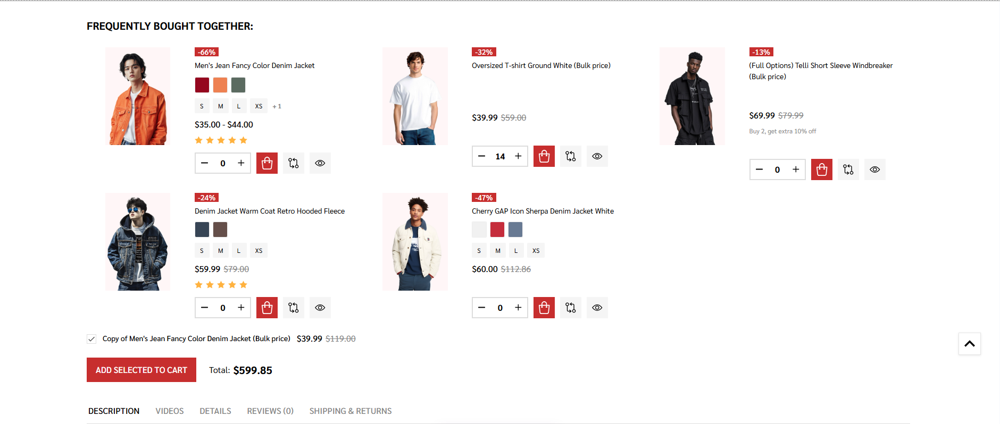

# FAQs

### Display Frequently bought together in fullwidth:



Go to Storefront > Script Manager, click Create a Script, choose:
 
- Location on page = ***Footer***
- Select pages where script will be added = ***All Pages***
- Script type = ***Script***
 
Enter the script below to Scripts contents:

```
<script>
const $productViewScope = document.querySelector(".productView-scope:not(.quickView)");
if ($productViewScope && $productViewScope.querySelector("._tabs-fullwidth") && window.innerWidth > 801) {
  $productViewScope.querySelector('.productView-additionalInfo').style.width = '100%';
}
</script>
```
