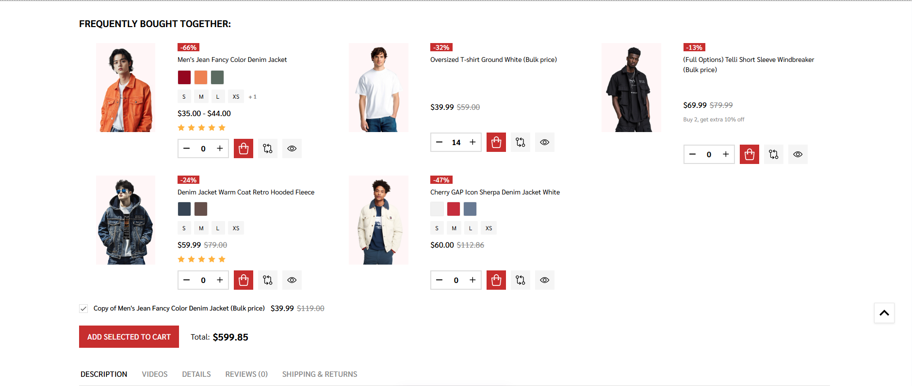

# FAQs

### Display Frequently bought together in fullwidth:



Go to Storefront > Script Manager, click Create a Script, choose:
 
- Location on page = ***Footer***
- Select pages where script will be added = ***All Pages***
- Script type = ***Script***
 
Enter the script below to Scripts contents:

```
<script>
const $productViewScope = document.querySelector(".productView-scope:not(.quickView)");
if ($productViewScope && $productViewScope.querySelector("._tabs-fullwidth") && window.innerWidth > 801) {
  $productViewScope.querySelector('.productView-additionalInfo').style.width = '100%';
}
</script>
```

### Remove the grey area (empty placeholder) in the cart popup:

A grey placeholder block can appear in the cart pop-up when the Social Proof "cart goal bar" feature is not enabled. This is fixed in the latest theme version. If you cannot update yet, apply the workaround below.

Go to Storefront > Script Manager, click Create a Script, choose:

- Location on page = ***Footer***
- Select pages where script will be added = ***All Pages***
- Script type = ***Script***

Enter the script below to Scripts contents:

```
<script>
(function () {
  var css = '.papathemes-socialproof-cart-goal[aria-busy="true"]{display:none !important;}';
  var style = document.createElement('style');
  style.appendChild(document.createTextNode(css));
  document.head.appendChild(style);
})();
</script>
```

This injects the rule via a script (Script Manager does not apply a raw `<style>` block). It hides only the unresolved placeholder: when the cart goal bar is off it stays hidden permanently, and when it is on the real bar still shows once it loads. After updating to the fixed theme version you may remove this script (optional).
